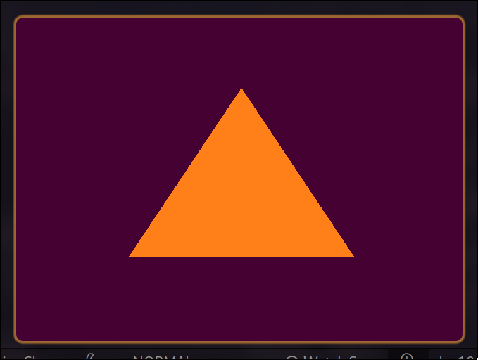

# :paintbrush: Graphics Labs

## Lab 1

### Objectives

* Project setup with cmake
* Opening a window using "glfw"
* Using "glad" to load OpenGL
* W a simple (vert, and frag) shaders
* Loading shaders from external files
* Drawing first Triangle using shaders

### Final Result

