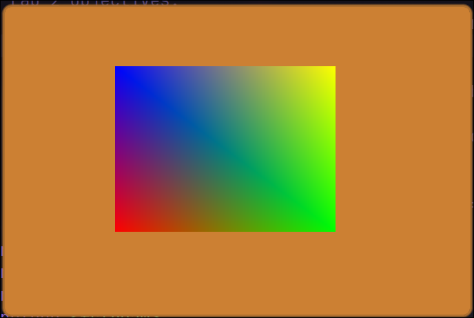

# :paintbrush: Graphics Labs

## Lab 1

### Objectives

* Project setup with cmake
* Opening a window using "glfw"
* Using "glad" to load OpenGL
* Writing a simple (vert, and frag) shaders
* Loading shaders from external files
* Drawing first Triangle using shaders

### Highlights

## Lab 2

### Objectives

* sending data from a shader to another shader (vars)
* streaming data from cpu to gpu (uniforms)
* sending data from the cpu to gpu as buffers
* elements buffer to removes duplicates from buffer arrays.

### Highlights

